# FPV Combat Gadget

DIY device (gadget) that helps you quickly adjust [FPV Combat](https://www.fpv-combat.com) board settings like player ID, player name, lives, ammo and many more.

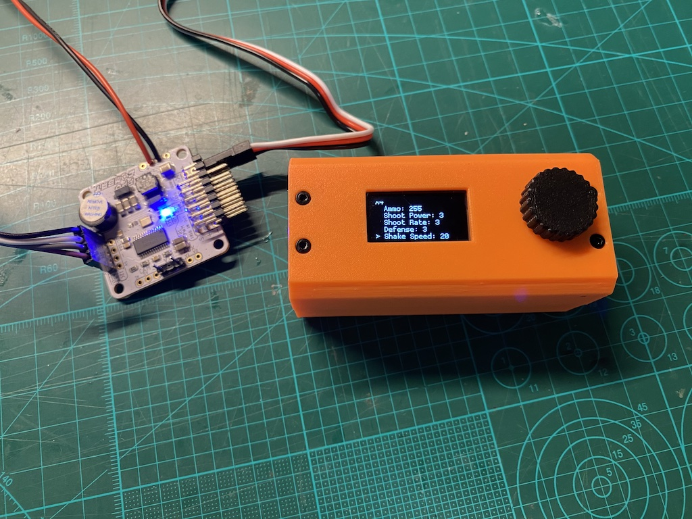

This is an alternative to classic way of using IR remote and board's OSD.

The gadget shall help digital (DJI, HDZero) users with no analog devices to get started.  
Also, it is a convenient way to adjust settings "on the go", at the field, for everyone.

You'll need to buy some electronic components and 3D print the case, see below.  
Soldering skills required.

Note: FPV Combat board shall be flashed with [firmware v2.5.0 or later](https://github.com/FPV-Combat/Main_board_v2/releases).

## Electronic Components

| Picture  | Item    | Comment | Price (per item)  |
| -------- | ------- | ------- | ------- |
| 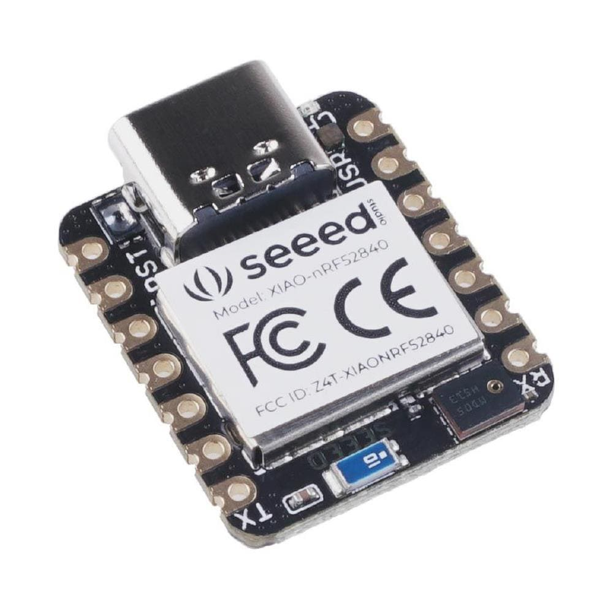 | [XIAO-nRF52840 board](https://www.seeedstudio.com/Seeed-XIAO-BLE-nRF52840-p-5201.html) | With battery charger | [$9.90](https://www.seeedstudio.com/Seeed-XIAO-BLE-nRF52840-p-5201.html) |
| 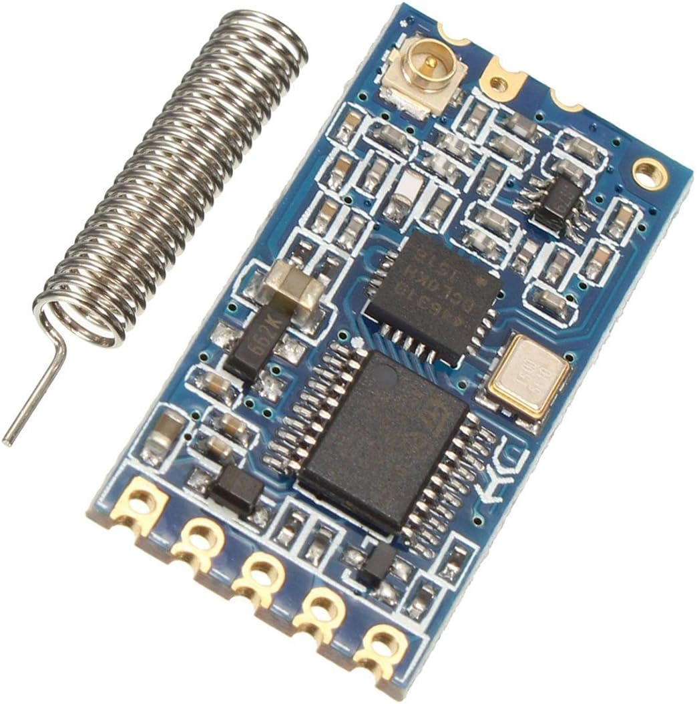 | [HC-12 network module](https://www.hc01.com/goods/640e91920be12d0114404c95) | 433Mhz | $12 |
| 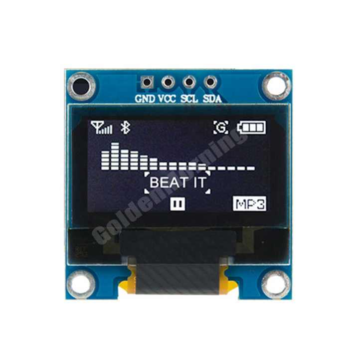 | [0.96inch display](https://www.az-delivery.de/en/products/0-96zolldisplay) | OLED 128 x 64 | [$2.4](https://www.alibaba.com/product-detail/Most-Popular-GME12864-White-4pins-I2C_1600270997819.html) - [$3.8](https://www.amazon.se/dp/B074NJMPYJ) |
| 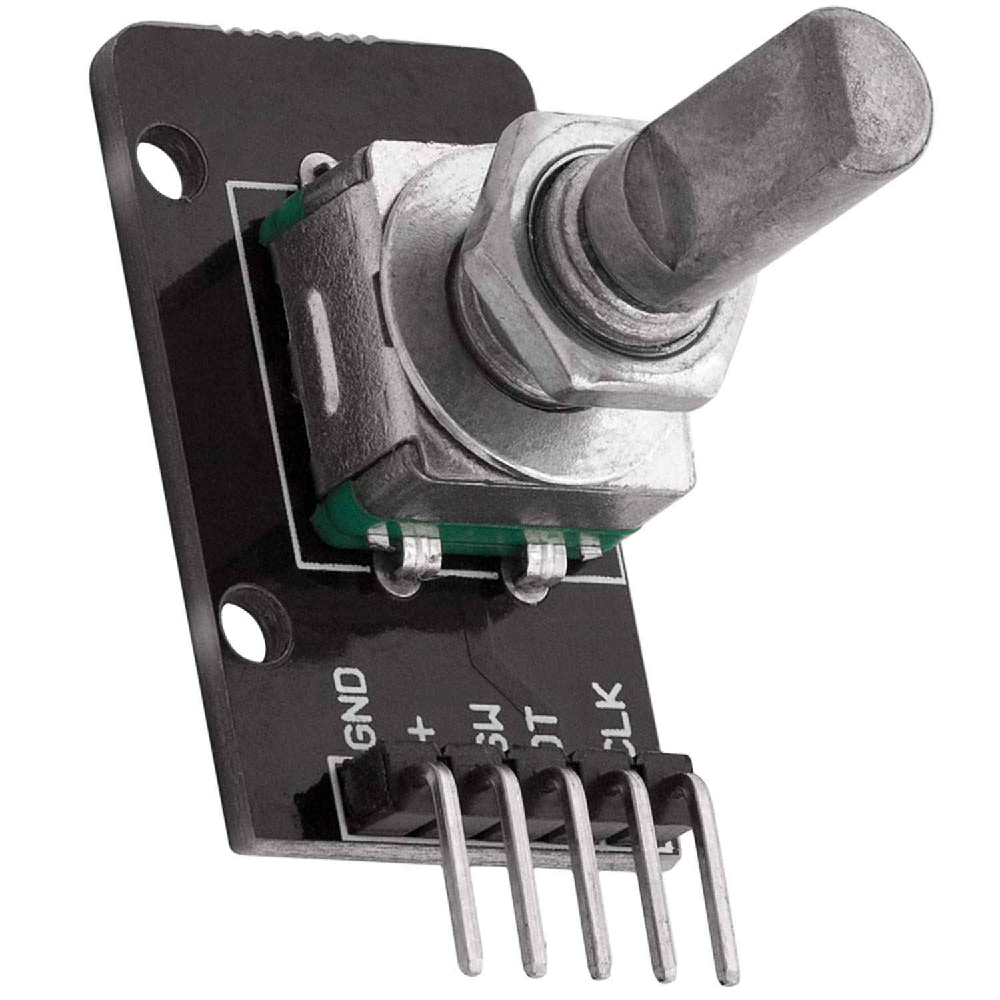 | KY-040 rotary encoder | Breakout | [$1.8](https://www.amazon.se/dp/B07TKK4QQD) |
| 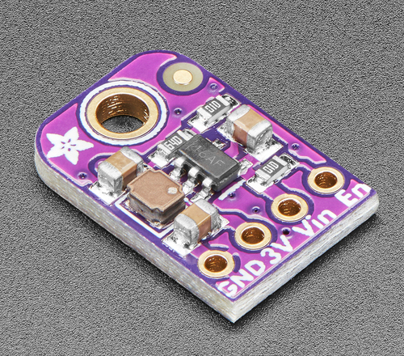 | [Adafruit TLV62569 (4711)](https://www.adafruit.com/product/4711) | Step-down converter 3.4~5.5V to 3.3V | [$3.95](https://www.digikey.se/sv/products/detail/adafruit-industries-llc/4711/13162412) |
| 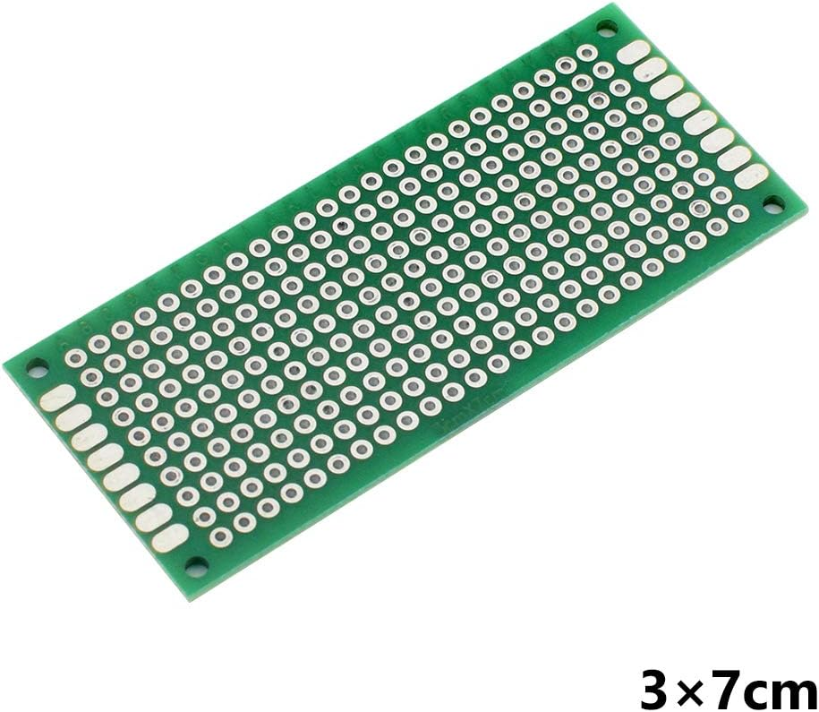 | Prototype board | 3 x 7 cm, or PCB | [$0.8](https://www.amazon.se/dp/B07CQQK214) |
| 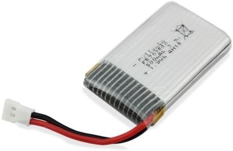 | LiPo Battery 500mAh | max 4.5 x 2.5 x 0.9 cm | [$11](https://www.amazon.se/dp/B01FBSA1N6/) |
| 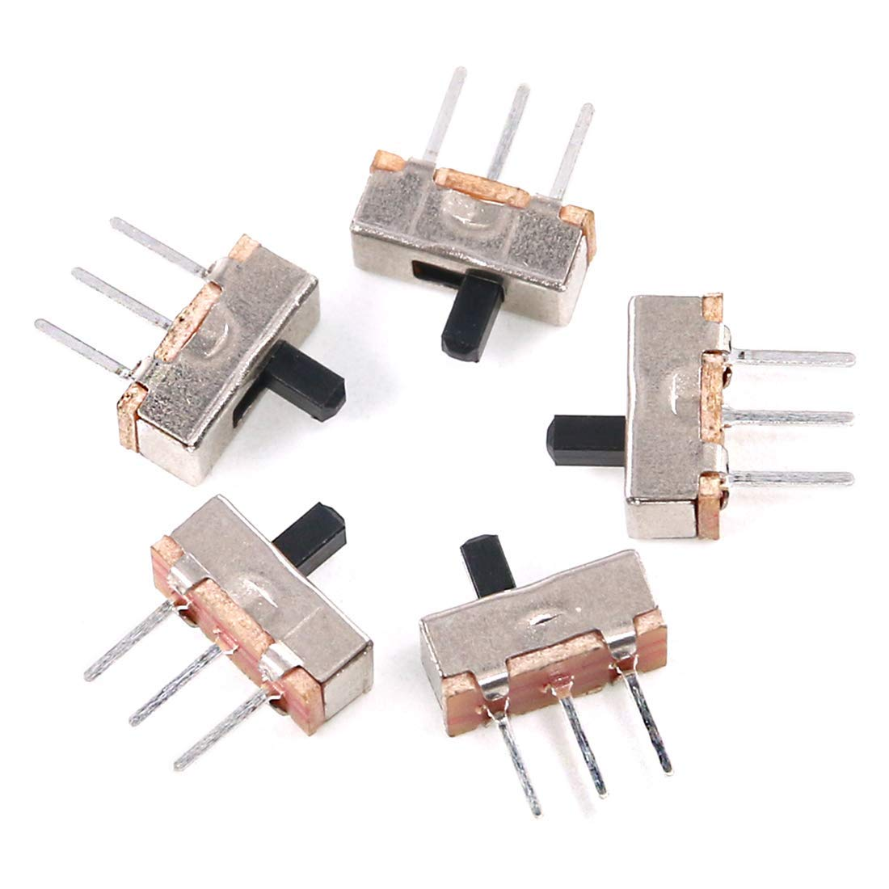 | Micro Slide Switch | 2 positions, 3 contacts | [$0.1](https://www.amazon.se/Gebildet-Vertikal-Switch-SS-12d00-Position/dp/B08L6FMV84/?th=1) | 
| **Total** ||| **$45** |

### Alternatives
- MCU
  - [XIAO-RP2040](https://www.seeedstudio.com/XIAO-RP2040-v1-0-p-5026.html) - $5.40 (cheaper, no battery charger)
  - [XIAO-nRF52840 Sense](https://www.seeedstudio.com/Seeed-XIAO-BLE-Sense-nRF52840-p-5253.html) - $15.99 (more expensive, has IMU that we don't use)
- Step-down converter
  - [LM3671](https://www.adafruit.com/product/2745) - $4.95
  - [TPS62827](https://www.adafruit.com/product/4920) - $6.95
  - [DFR0568](https://www.dfrobot.com/product-1765.html) - $2.9
- Battery charger (optional, use with MCU w/o built-in battery charger)
  - [Greluma 6st](https://www.amazon.se/dp/B09WMVLWH5)

## Assembly

It is possible to [order the gadget](https://www.etsy.com/se-en/listing/1589030767/fpv-combat-gadget-battery-not-included) either fully assembled, as a kit or just PCB from [our shop on Etsy](https://www.etsy.com/se-en/shop/SkyGadgets).

Alternatively, you can always order PCB yourself from PCBWay, JLCPCB and alike or use 3x7cm prototype board.

Pictured is the gadget prototype.  

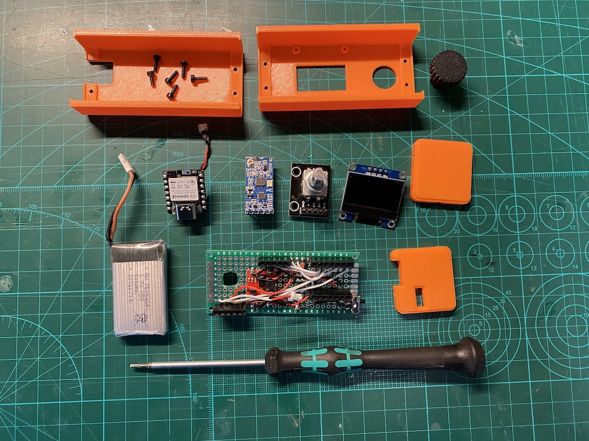

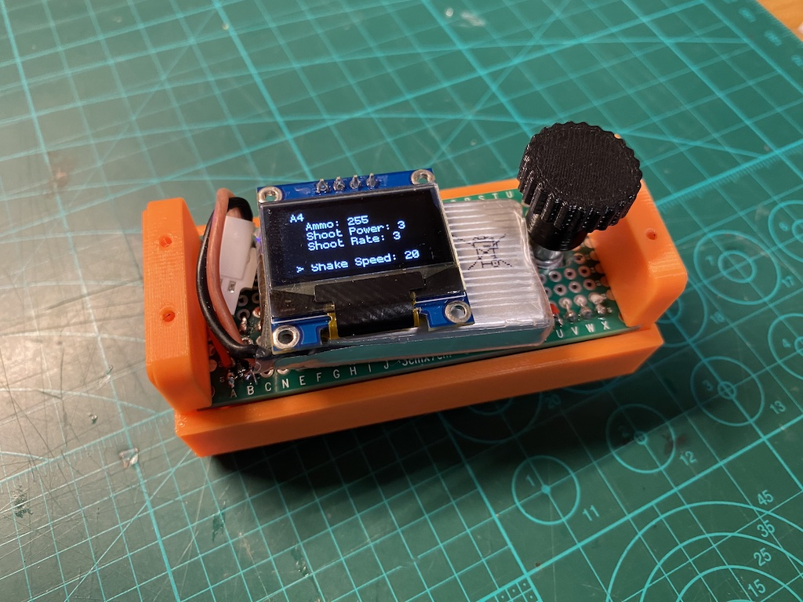 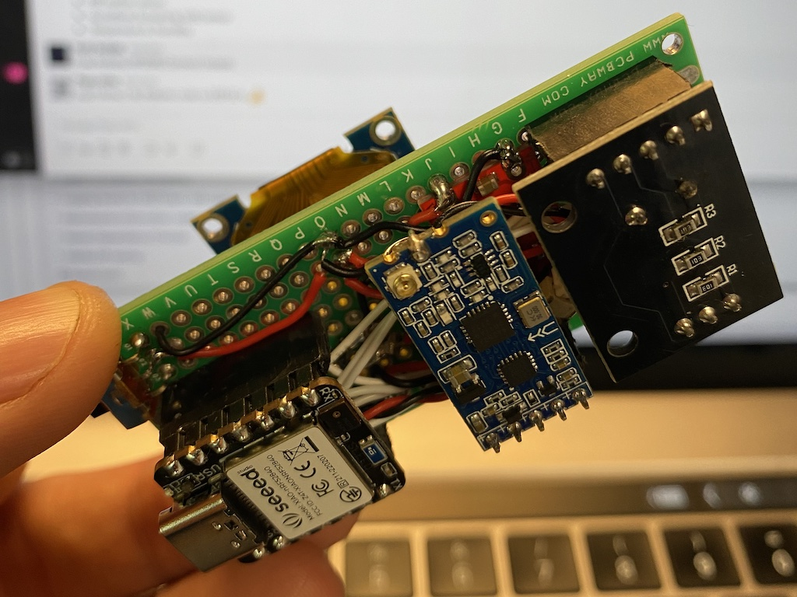

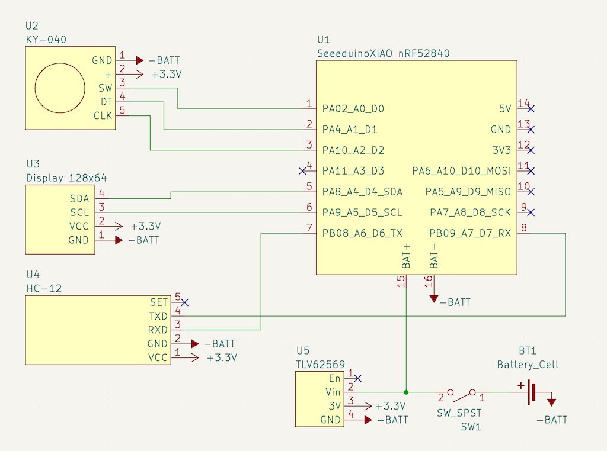

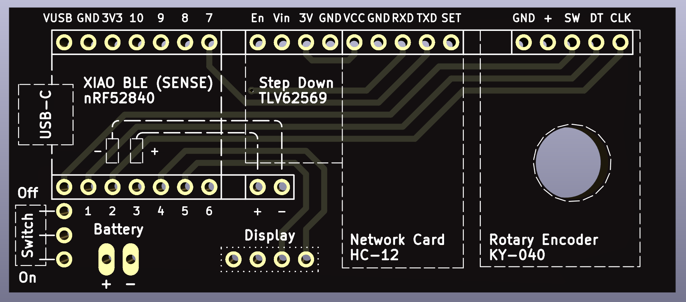

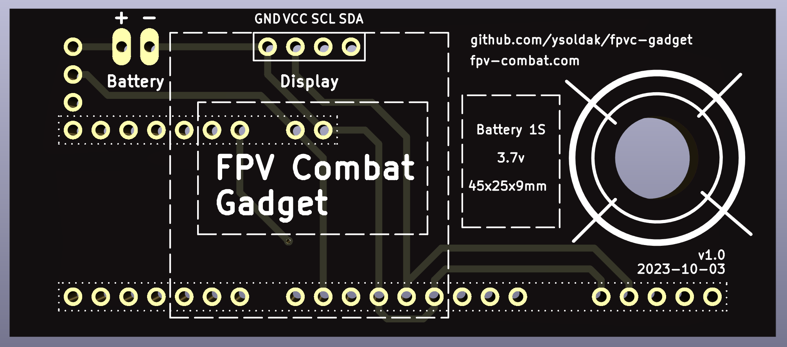

## Contacts

Join our [FPV-Combat Community](https://www.facebook.com/groups/2441262976051510/)

Questions? [Make an issue](https://github.com/ysoldak/fpvc-gadget/issues) on this repository or search Yurii Soldak in our FB group.
