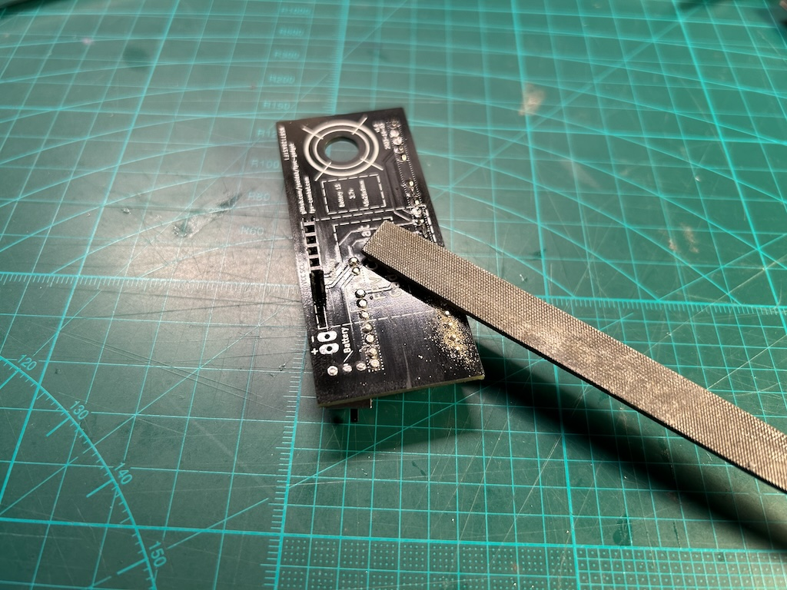
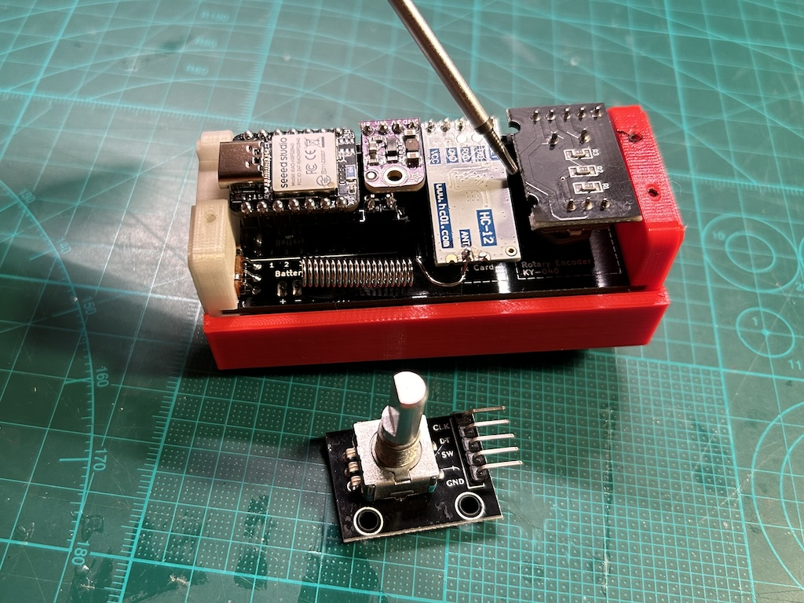

# FPV Combat Gadget

DIY device (gadget) that helps you quickly adjust [FPV Combat](https://www.fpv-combat.com) board settings like player ID, player name, lives, ammo and many more.

This is an alternative to classic way of using OSD menu (and IR remote earlier).  
It is a convenient way to adjust settings "on the go", at the field, for everyone.

FPV Combat board shall be flashed with compatible [firmware](https://github.com/FPV-Combat/Main_board_v2/releases).

**Gadget version 0.5.0+ requires FPV Combat version 2.8.0+.**

## Electronic Components

You'll need to buy some electronic components and 3D print the case, see below.  
Soldering skills required.

| Picture  | Item    | Comment | Price (per item)  |
| -------- | ------- | ------- | ------- |
|  | [XIAO-nRF52840 board](https://www.seeedstudio.com/Seeed-XIAO-BLE-nRF52840-p-5201.html) | With battery charger | [$9.90](https://www.seeedstudio.com/Seeed-XIAO-BLE-nRF52840-p-5201.html) |
|  | [HC-12 network module](https://www.hc01.com/goods/640e91920be12d0114404c95) | 433Mhz | $12 |
|  | [0.96inch display](https://www.az-delivery.de/en/products/0-96zolldisplay) | OLED 128 x 64 | [$2.4](https://www.alibaba.com/product-detail/Most-Popular-GME12864-White-4pins-I2C_1600270997819.html) - [$3.8](https://www.amazon.se/dp/B074NJMPYJ) |
|  | KY-040 rotary encoder | Breakout | [$1.8](https://www.amazon.se/dp/B07TKK4QQD) |
|  | [Adafruit TLV62569 (4711)](https://www.adafruit.com/product/4711) | Step-down converter 3.4~5.5V to 3.3V | [$3.95](https://www.digikey.se/sv/products/detail/adafruit-industries-llc/4711/13162412) |
|  | Prototype board | 30 x 70 mm, or PCB | [$0.8](https://www.amazon.se/dp/B07CQQK214) |
|  | LiPo Battery | 1S, 100-500mAh, 45 x 25 x 9 mm | [$11](https://www.amazon.se/dp/B01FBSA1N6/) |
|  | Micro Slide Switch | 2 positions, 3 contacts | [$0.1](https://www.amazon.se/Gebildet-Vertikal-Switch-SS-12d00-Position/dp/B08L6FMV84/?th=1) | 
| **Total** ||| **$45** |

### Alternatives
- MCU
  - [XIAO-RP2040](https://www.seeedstudio.com/XIAO-RP2040-v1-0-p-5026.html) - $5.40 (cheaper, no battery charger)
  - [XIAO-nRF52840 Sense](https://www.seeedstudio.com/Seeed-XIAO-BLE-Sense-nRF52840-p-5253.html) - $15.99 (more expensive, has IMU that we don't use)
- Step-down converter
  - [LM3671](https://www.adafruit.com/product/2745) - $4.95
  - [TPS62827](https://www.adafruit.com/product/4920) - $6.95
  - [DFR0568](https://www.dfrobot.com/product-1765.html) - $2.9
- Battery charger (optional, use with MCU w/o built-in battery charger)
  - [Greluma 6st](https://www.amazon.se/dp/B09WMVLWH5)

## Assembly

It is possible to [order the gadget](https://www.etsy.com/se-en/listing/1589030767/fpv-combat-gadget-battery-not-included) either fully assembled, as a kit or just PCB from [our shop on Etsy](https://www.etsy.com/se-en/shop/SkyGadgets).

Alternatively, you can always order PCB yourself from PCBWay, JLCPCB and alike or use 30x70mm prototype board.

### Assembly tips

- Once soldered, backs of pins/slots have to be filed out/flattened, otherwise risk of damaging the battery;
- Straighten encoder pins and cut them a bit, just a several mm;
- Cut a bit of encoder pcb, across mounting holes, otherwise it does not fit;
- HC-12 is placed white (flat) side up;
- Pull HC-12 antenna a little so it is away from everything to minimise interference.

### Schematic

### PCB

## Contacts

Join our [FPV-Combat Community](https://www.facebook.com/groups/2441262976051510/)

Questions? [Make an issue](https://github.com/ysoldak/fpvc-gadget/issues) on this repository or search Yurii Soldak in our FB group.
